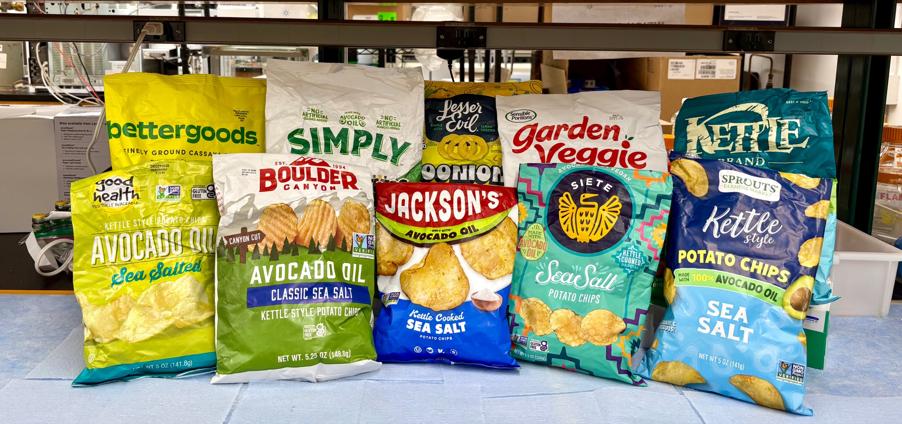

If a package says avocado oil is its only added oil, is that actually what you are getting?

A new [UC Davis study](https://doi.org/10.1016/j.afres.2026.102389) tested that question in chips, mayonnaise, and salad dressing. Researchers bought two different lots of 27 avocado oil products in 2025 and 2026, extracted the oil, and compared its chemical fingerprint with authentic avocado oil.

Of the 54 samples, **48 did not match authentic avocado oil.** Only six did. UC Davis also published its [product-by-product results and study limitations](https://ucdavis.app.box.com/s/6ogs4l0ogplunooktwryr5b1m6k2xr9u).

But the most useful part is not the shocking percentage. It is the very short list of products that performed well.

> **The strongest avocado oil results:** [Grove AvoYeah! Mayo Sauce](https://amzn.to/4weBLAb) and [Grove AvoYeah! Garlic Aioli](https://amzn.to/4g0kmFv). All tested lots of both products matched authentic avocado oil. No avocado oil chips or salad dressing passed in both lots. Prefer olive oil? [Graza "Original" Mayo](https://amzn.to/4hYXZTd) and [Graza "Fancy" Mayo](https://amzn.to/4wSPOwA) also passed both lots. [See every olive oil product that passed twice](#olive-oil-products-did-much-better).

## The Two Avocado Oil Products That Passed Both Lots

### [Grove AvoYeah! Mayo Sauce](https://amzn.to/4weBLAb)

Researchers tested two different lots of [Grove AvoYeah! Mayo Sauce](https://amzn.to/4weBLAb). The oil extracted from **both** matched the fatty-acid and sterol ranges expected for authentic avocado oil.

### [Grove AvoYeah! Garlic Aioli](https://amzn.to/4g0kmFv)

Both tested lots of [Grove AvoYeah! Garlic Aioli](https://amzn.to/4g0kmFv) also matched authentic avocado oil.

These were the only avocado oil products in the study to pass twice. That makes them the most reassuring picks from this particular test, although the results still apply only to the lots purchased by the researchers. Grove is a New Zealand brand, and U.S. availability appears limited.

## Two Olive Oil Mayos Also Passed Both Lots

The study's olive oil comparison included two Graza mayos, and both tested lots of each product matched authentic olive oil:

- [Graza "Original" Mayo](https://amzn.to/4hYXZTd), made with olive pomace oil and extra-virgin olive oil
- [Graza "Fancy" Mayo](https://amzn.to/4wSPOwA), made with extra-virgin olive oil

These are the clearest mayonnaise alternatives if Grove is difficult to find in the United States. They were part of a [much stronger set of olive oil results](#olive-oil-products-did-much-better), with 19 of 20 olive oil samples matching the oil named on the label.

## Two Chips Had Mixed Results

Two avocado oil chip products produced one passing sample each:

- LesserEvil Intergalactic Onion Moonions
- Simply Tostitos Sea Salt & Avocado Oil Tortilla Chips

For each product, **one lot matched authentic avocado oil and the other did not.** I would not describe either as a clean pass. The disagreement between lots is exactly why one good result cannot verify a product as a whole.

Every other avocado oil chip sample in the study was inconsistent with authentic avocado oil.

## No Avocado Oil Salad Dressing Passed

The researchers tested two lots each of six avocado oil salad dressings. **All 12 samples were inconsistent with authentic avocado oil.**

The category results were:

- **Chips:** 2 of 28 samples matched authentic avocado oil
- **Mayonnaise:** 4 of 14 matched
- **Salad dressing:** 0 of 12 matched
- **Overall:** 6 of 54 matched

That does not show that every bottle or bag from those brands will always have the same result. It does show that an avocado oil claim on the front of a processed-food package was not a reliable authenticity signal in this sample of the market.

## Olive Oil Products Did Much Better

The researchers ran the same type of analysis on 20 processed-food samples labeled with olive oil. **Nineteen of the 20 matched authentic olive oil.**

These olive oil products passed in both tested lots:

- [Lay's Baked BBQ Flavored Potato Crisps Made with Olive Oil](https://amzn.to/45VIswc)
- [Trader Joe's Kettle Cooked Olive Oil Potato Chips](https://amzn.to/4xobIro)
- [Torres Extra Virgin Olive Oil Potato Chips](https://amzn.to/4xxJN8t)
- [Graza Extra Virgin Olive Oil Potato Chips](https://www.amazon.com/s?k=Graza+Extra+Virgin+Olive+Oil+Potato+Chips)
- [Bella Sun Luci Sonoma Vinaigrette Made with 100% Olive Oil](https://amzn.to/4wTTVIO)
- [Bragg Organic Vinaigrette Dressing Made with 100% Extra Virgin Olive Oil](https://www.amazon.com/s?k=Bragg+Organic+Vinaigrette+Dressing+Extra+Virgin+Olive+Oil)
- [California Olive Ranch Balsamic Vinaigrette Dressing Made with Extra Virgin Olive Oil](https://amzn.to/4cu5xd6)
- [Graza "Original" Mayo made with olive pomace oil and extra-virgin olive oil](https://amzn.to/4hYXZTd)
- [Graza "Fancy" Mayo made with extra-virgin olive oil](https://amzn.to/4wSPOwA)

Boulder Canyon Olive Oil Classic Sea Salt Kettle Style Potato Chips had a mixed result: one lot matched and one did not.

If I were choosing strictly from this study, I would be more comfortable paying a premium for one of the olive oil products that passed twice than for an avocado oil chip or dressing.

## How the Test Worked

The researchers did not rely on the ingredient list or taste. They extracted the oil from each food and measured its **fatty acids and sterols**. These act like a chemical fingerprint: different oils have characteristic patterns.

*Photo: Natalie Lopez-Alvarez/[UC Davis](https://www.ucdavis.edu/food/news/avocado-oil-chip-youre-eating-may-not-be-made-pure-avocado-oil)*

One reasonable question is whether frying or emulsifying the food could change that fingerprint enough to create a false failure. As [UC Davis explains in its study summary](https://www.ucdavis.edu/food/news/avocado-oil-chip-youre-eating-may-not-be-made-pure-avocado-oil), the researchers tested processing effects and found that the key fatty-acid and sterol markers changed only minimally. They also allowed a 10% margin to account for natural differences such as avocado variety and growing region.

Even with that extra room, 89% of the avocado oil samples fell outside the expected range.

## What a Failure Does and Does Not Mean

An inconsistent result means the oil extracted from that sample did not have the composition expected of authentic avocado oil. It does **not** tell us that the brand knowingly substituted another oil, and it does not identify every other oil that may have been present.

The researchers noted that brands often buy oil through brokers or multiple suppliers. A manufacturer may not know that an ingredient has been diluted or substituted unless it tests incoming oil itself.

This was also a marketplace snapshot, not a permanent certification or condemnation of any brand. The products were purchased in 2025 and 2026, and only two lots of each product were tested. Suppliers, recipes, and quality-control practices can change.

## My Practical Takeaway

For avocado oil mayonnaise, the two Grove AvoYeah! products are the only repeat passes from this study.

For chips, I would not treat a single passing lot as enough evidence to pay more for an avocado oil label. If oil authenticity is the deciding factor, the olive oil products with two passing lots have stronger evidence behind them.

And I would keep the question narrow: this study tested **whether the oil matched the label**, not whether one type of oil produces better health outcomes. The clear consumer issue is that people paid a premium for avocado oil and, in most tested samples, did not appear to receive pure avocado oil.
