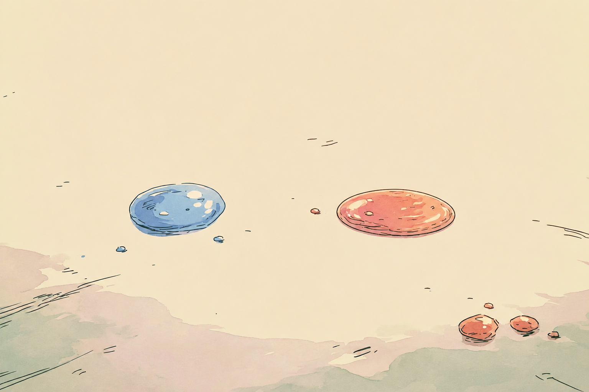
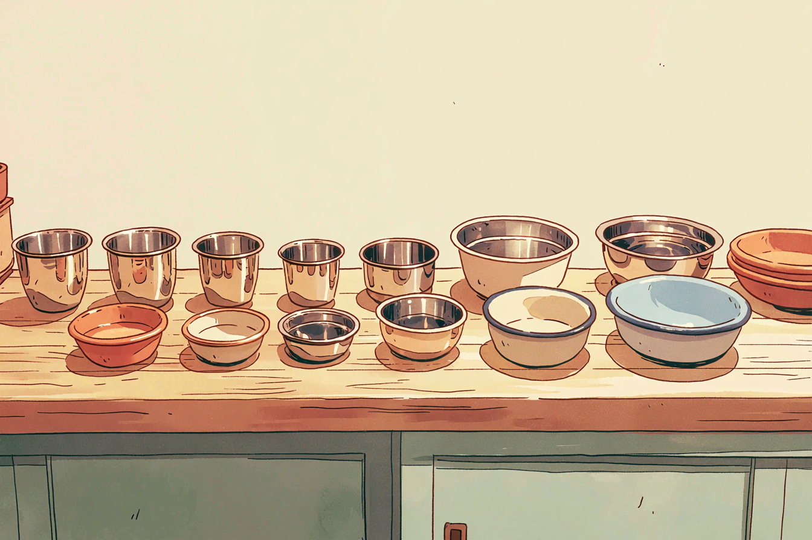
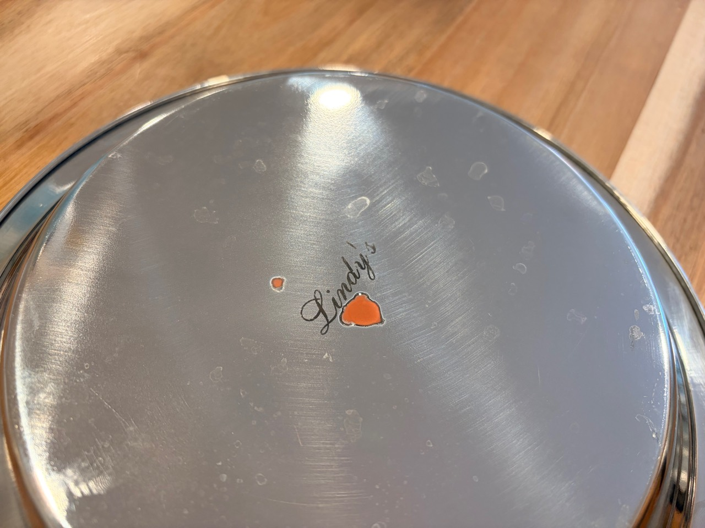

Not all stainless steel is the same: 300-series generally resists corrosion better, while cheaper 200-series uses less nickel and can leach more heavy metals into your foods as it corrodes.

The [$30 kit I bought](https://amzn.to/4vFsEbC) is a little bottle of liquid that changes color to tell you if your stainless steel is 200-series or 300-series. You wash and dry the item, place one drop on the food contact surface, and wait two minutes to see if there's a color change.

The colors are easy to read: blue-green means the item should be 304 stainless steel (a pass). Pink, orange, or copper means it probably is not food-safe (a fail). When most product labels just say "stainless steel," a $30 test buys a lot of peace of mind.

I tested everything in our family's kitchen. Our Yeti, Stanley, and Hydro Flask mugs all passed, as did our stainless steel toddler dinnerware (phew). Two of my GoodCook mixing bowls turned bright pink. So did a pie plate, and an unbranded pitcher from Amazon. All three were sold as stainless steel, and I had used them for years without thinking twice about it. The test leaves an orange spot on the failing products, which is a great way to mark items destined for the recycling.

I still recommend replacing plastic with stainless steel and glass, as described in [The Truth About BPA-Free Plastics](/p/the-truth-about-bpa-free-plastics/) and [The Best Budget Non-Toxic Glass Food Storage](/p/the-best-budget-non-toxic-glass-food/). I am just more careful now about what "stainless steel" on a label really tells us.

## Stainless Steel Is a Family

There is no single stainless steel. The kitchen-relevant families include:

- **300-series austenitic steel:** Type 304 is commonly used for bowls, bottles, containers, and other formed kitchenware. "18/8" refers to nominal chromium and nickel content and is commonly associated with 304. "18/10" is often marketing shorthand rather than a precise promise of 10% nickel. Type 316 adds molybdenum and is more resistant in demanding salt and chloride environments.
- **200-series austenitic steel:** These alloys replace some nickel with manganese and nitrogen. They are real stainless steels, not inherently "fake," but grade substitution matters because different alloys have different corrosion performance. The right question is whether the manufacturer disclosed and supplied the grade promised for the intended use.
- **400-series ferritic or martensitic steel:** Type 430 is common in lower-cost cutlery and kitchen equipment. Hardenable martensitic grades such as 420 and 1.4116 are used for knife blades because 304 and 18/10 steel cannot be heat-treated to hold a comparable cutting edge.

The [British Stainless Steel Association's food-industry guidance](https://bssa.org.uk/bssa_articles/selection-of-stainless-steels-for-the-food-processing-industries/) lists 304 for vats, bowls, and machinery, while listing martensitic 420 for cooks' and professional knives. Its [cutlery guide](https://bssa.org.uk/bssa_articles/cutlery-stainless-steel-grades/) explains why a table knife may combine a martensitic blade with an 18/8 or 18/10 handle. [Outokumpu's overview of stainless families](https://www.outokumpu.com/en/expertise/2020/the-stainless-steel-family) likewise describes 200-series steel as lower-nickel austenitic steel and martensitic grades as hardenable alloys used for knives.

This makes kitchen knives an exception: **an orange result on a knife blade is not evidence that the knife is counterfeit or unsafe.** It may be exactly the low-nickel, martensitic stainless steel the blade needs to be.

## What We Tested

I ran the reagent across our kitchen. This is a record of the observed spot-test behavior, not a lab certificate for each product.

### Reacted pink or orange on vessels

- GoodCook stainless steel mixing bowls (set of three): all three turned bright pink.
- An unbranded stainless steel mixing pitcher from Amazon: turned pink in under a minute.
- Lindy's stainless steel pie plate: developed a bright orange deposit even though the product was represented as stainless steel.

The pie plate was the most useful purchasing lesson. "Stainless steel" is marketplace copy, which is not the same as traceable material documentation. It doesn't tell you the plate's exact grade.

### No color change

- [U Konserve toddler plate / container](https://amzn.to/4hdR9sK)
- [Liberty Tabletop flatware](https://amzn.to/4lKqXWF) and [Kleynimals baby utensils](https://amzn.to/3YfamQD)
- [Ahimsa toddler cups](https://amzn.to/44HGAXv)
- [Yeti mug](https://amzn.to/43z9xV5), made in China

### No color change, but a faint shadow remained

- [Hydro Flask mugs](https://amzn.to/4abxhTc)
- [U Konserve stainless food storage containers](https://amzn.to/3ZzYuJt)
- [Yeti tumbler](https://amzn.to/43z9xV5), made in Malaysia

The shadow spot could indicate a thinner passive layer or a different factory process. The defensible observation is that the test didn't fail, but the finish retained a visible mark.

## What to Do With a Reactive Vessel

An orange result on a bowl, bottle, storage container, or baking pan sold as 304 or 18/8 is worth following up, but it is not an emergency.

1. Save the product listing, packaging, lot number, and photos of the timed result.
1. Ask the manufacturer for the exact grade or UNS/EN designation and whether the claim applies to every food-contact component.
1. If the answer matters enough to justify the cost, use professional XRF or OES analysis. XRF cannot measure every light element well, but it can provide far more useful composition data than a color spot alone.
1. If the item is low-cost, undocumented, visibly corroding, or no longer earns your confidence, replace or recycle it as a practical choice - not because the spot test proved poisoning.

This process also taught me that a documented 304 replacement is not always easy to buy. Pie plates were a good example: many listings said only "stainless steel," while the strongly documented 304 options were expensive, oversized, dealer-only, or unavailable. A different material can be the better default. The [Lodge 9-inch cast iron pie pan](https://www.lodgecastiron.com/product/seasoned-cast-iron-pie-pan) is made in the USA, seasoned with vegetable oil, and sold by Lodge as made without PFAS. It is heavier and needs hand washing, thorough drying, and light oiling, but it avoids an unresolved stainless-alloy claim.

## How I Shop Now

- **Look for a current, specific grade disclosure.** "304," "316," a UNS/EN number, or a material certificate is more useful than generic "premium stainless" language.
- **Treat 18/10 as marketing shorthand, not a superior grade.** The BSSA notes that it is essentially the same grade family as 18/8/304 and does not necessarily mean the steel contains a measured 10% nickel.
- **Match the alloy to the job.** I want documented 304 or 316 for food use and storage. I expect a disclosed martensitic knife steel for a cutting blade.
- **Do not use price, weight, magnetism, or a spot test as proof by itself.** Each can be a clue. None conclusively assigns a grade.
- **Prefer current manufacturer documentation over search snippets or old cached claims.** If the live product page no longer states the alloy, I treat it as undisclosed until the manufacturer confirms it in writing.

## Bottom Line

The [$30 Wotermly test kit](https://amzn.to/4vFsEbC) has a permanent place in my kitchen toolkit. It prevented me from continued use of lower-grade stainless steel that may have leached heavy metals into my family's food.

The best default is a chain of evidence: a material claim specific to the product; current manufacturer documentation; and failing those, a sanity-check screening test. For $30, it buys a lot of peace of mind.


If you choose to make a purchase through some of the links on this page, I may receive a small thank-you commission as an Amazon affiliate—at no cost to you! Thank you for your support!

